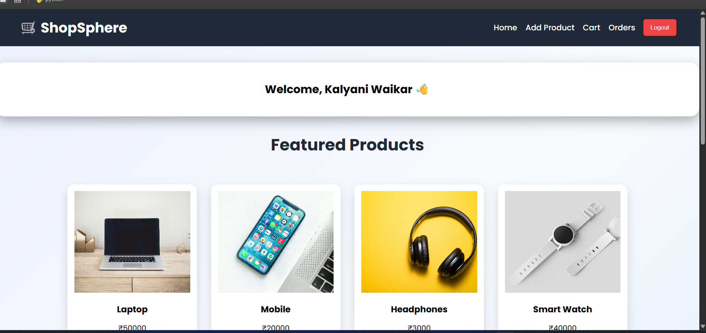
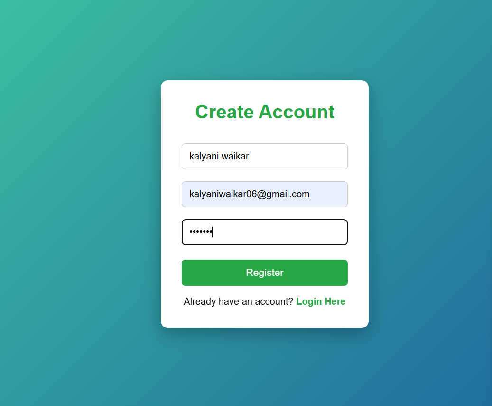
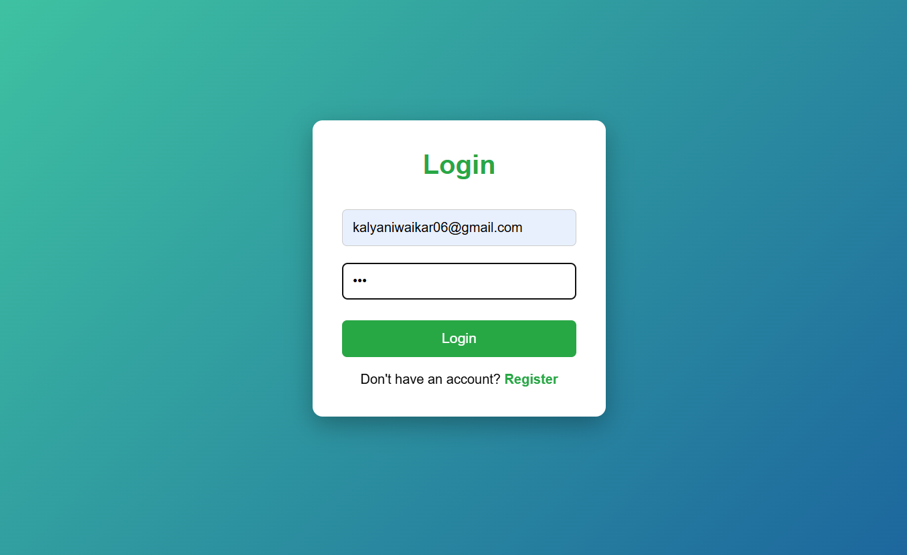
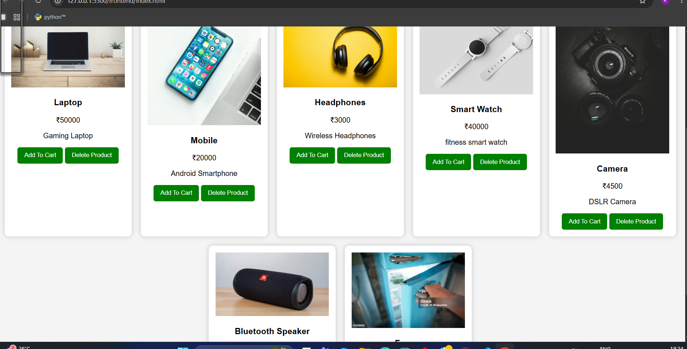
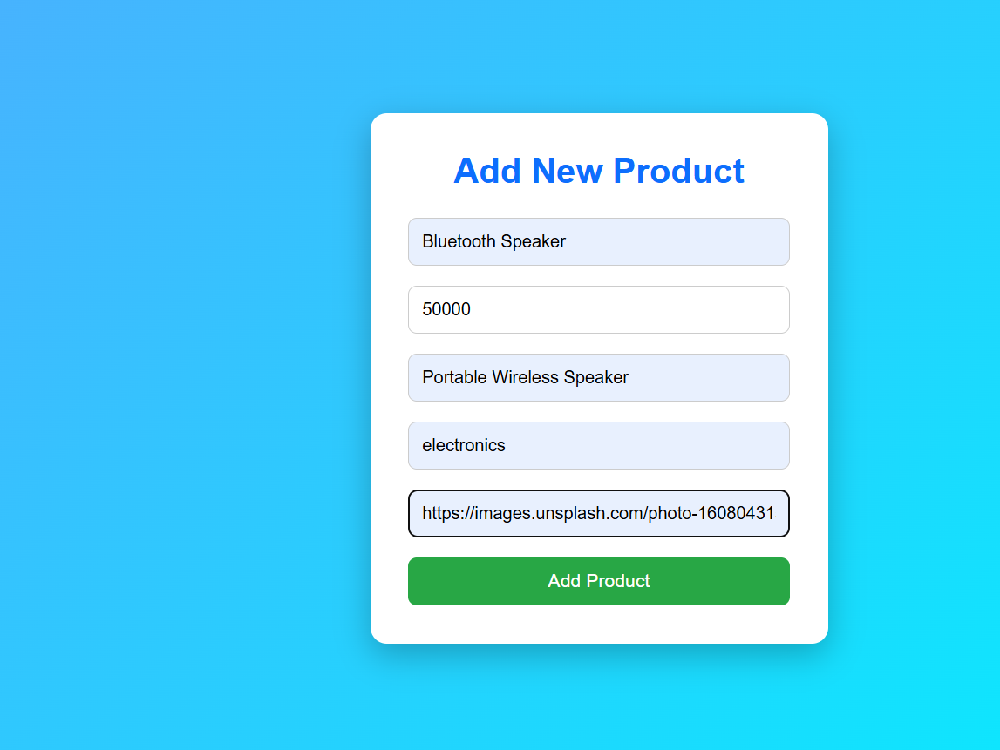
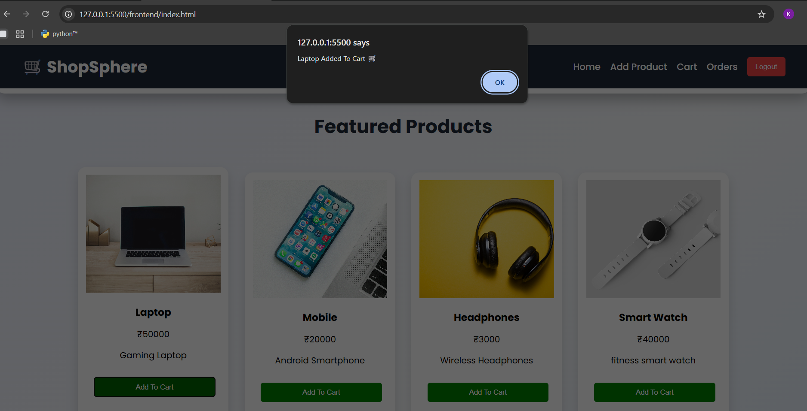
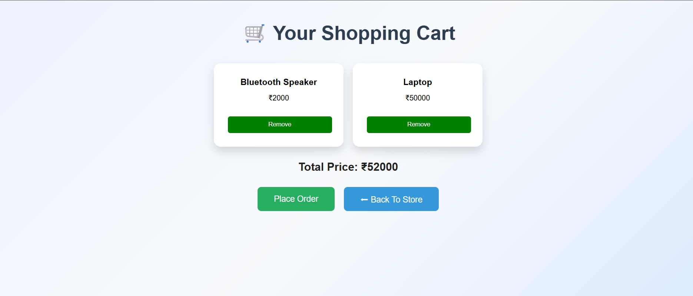
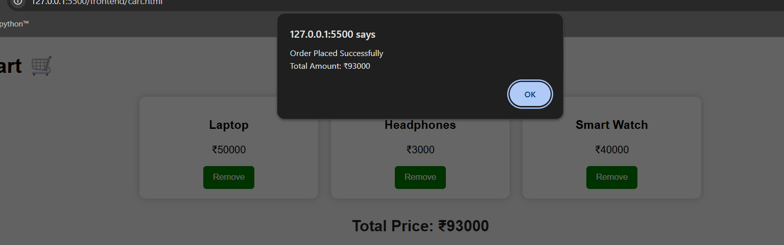
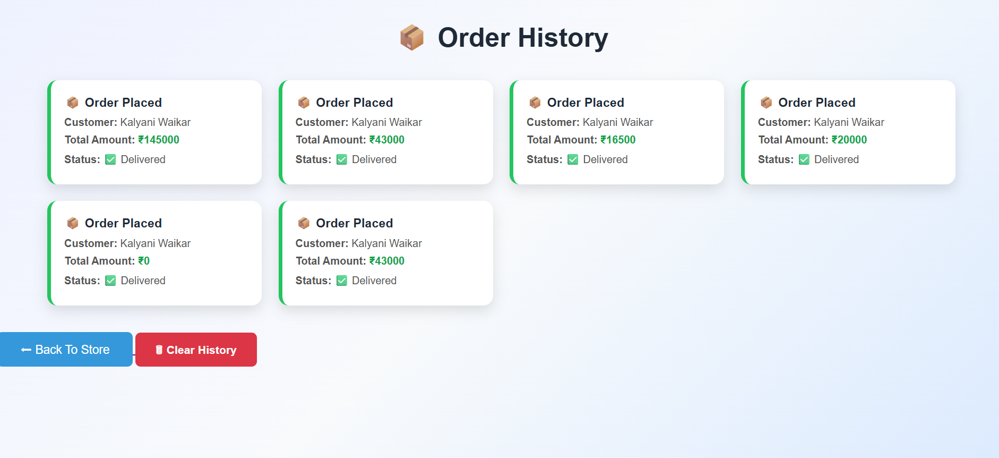

# CodeAlpha E-Commerce Website

A Full Stack E-Commerce Web Application built using Node.js, Express.js, MongoDB, HTML, CSS, and JavaScript.

## Features

- User Registration
- User Login & Logout
- Product Listing
- Add Product
- Product Images
- Add to Cart
- Remove from Cart
- Order Placement
- User-wise Order History
- MongoDB Database Integration

## Tech Stack

### Frontend
- HTML
- CSS
- JavaScript

### Backend
- Node.js
- Express.js

### Database
- MongoDB

## Project Screenshots

### Home Page


### Register Page


### Login Page


### Product Listing


### Add Product


### Added To Cart


### Cart Page


### Orders


### Order History


## How to Run

1. Install dependencies

```bash
npm install
```

2. Start MongoDB

3. Run the server

```bash
node server.js
```

4. Open in browser

```text
http://localhost:5000
```

## Author

**Kalyani Waikar**